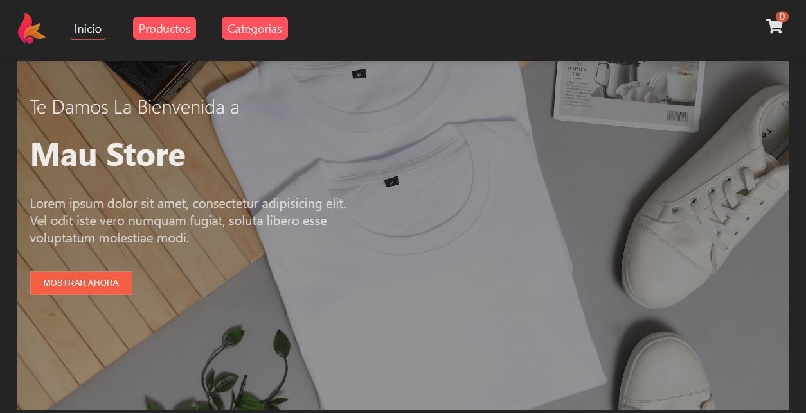

# MAU STORE

## Descripción

"Mau Store" es una aplicación web construida con React que permite a los usuarios explorar y comprar ropa para dama, caballero y niños.

## Los usuarios pueden:

- Agregar productos al carrito de compras.
- Eliminar productos del carrito.
- Aumentar o disminuir la cantidad de productos en el carrito.
- Completar un formulario de orden de compra.
- Almacenar los datos de la orden en Firebase.

## Uso de Firebase

En esta aplicación, se utiliza Firebase como base de datos en tiempo real para almacenar y gestionar los productos en el catálogo de ropa. Los productos se agregan a Firebase cuando un usuario realiza una compra o realiza cambios en el catálogo. A continuación, se destacan algunas de las funcionalidades clave relacionadas con Firebase:

### Almacenamiento de Productos

Los productos disponibles en la tienda se almacenan en Firebase, lo que permite una gestión centralizada de los datos. Cada producto se guarda con detalles como nombre, precio, categoría, etc.

### Sincronización en Tiempo Real

Firebase ofrece sincronización en tiempo real, lo que significa que los cambios realizados en el catálogo se reflejan automáticamente en la aplicación sin necesidad de recargar la página.

### Acceso a Datos

Se utiliza Firebase SDK para acceder a los datos almacenados y actualizar el catálogo de productos en función de las acciones de los usuarios, como agregar o eliminar productos del carrito.

## Características

- Catálogo de ropa para dama, caballero y niños.
- Carrito de compras interactivo.
- Formulario de orden de compra.
- Almacenamiento de datos en Firebase.

## Tecnologías Utilizadas

- React
- Firebase
- sweetalert2
- React Icons

## Hooks de React Utilizados

En este proyecto, se han utilizado varios hooks de React para gestionar el estado y la lógica de la aplicación. Algunos de los hooks utilizados incluyen:

### useState

El hook `useState` se utiliza para gestionar el estado local de la aplicación, como el estado del carrito de compras y los datos del formulario de orden de compra.

### useEffect

El hook `useEffect` se emplea para realizar efectos secundarios en la aplicación, como cargar datos del catálogo de ropa o sincronizar datos con Firebase.

### useContext

El hook `useContext` se utiliza en combinación con el contexto de React para proporcionar datos globales a través de la aplicación, como el estado compartido del carrito de compras.

### useReducer

El hook `useReducer` se utiliza para gestionar acciones complejas en la aplicación, como agregar, eliminar o actualizar productos en el carrito de compras.

## Demo en Línea

---

[Enlace a la interfaz de usuario](https://shoping-cartreact-fredi-torres-82nrqka0o-maudesings-projects.vercel.app/)

---